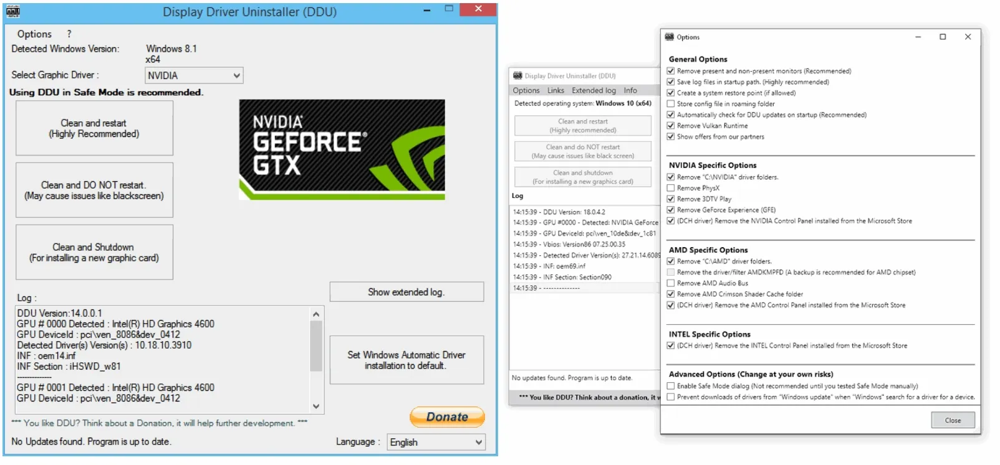

# Display Driver Uninstaller DDU
Download Display Driver Uninstaller DDU (official) - The latest release of Display Driver Uninstaller (DDU), version 18.1.3.1. The popular tool Display Driver Uninstaller (DDU) has just been updated to version 18.1.3.1. This utility is widely used by PC enthusiasts and technicians for completely removing graphics drivers and related files when switching between GPUs or troubleshooting driver issues. The new release focuses on improving driver cleanup, especially for AMD hardware, and includes some important fixes for Windows configurations.
If you have a problem installing an older driver or newer one, give it a try as there are some reports that it fix those problems. Guru3D.com is an official download partner for this handy application. We have AMD support thread over here and an NVIDIA over here. 

DDU 18.1.3.1 works on a wide range of operating systems, from Windows 7 all the way to Windows 11. It supports graphics drivers from NVIDIA, AMD, and Intel, and can also handle basic Realtek audio driver cleanup. To run the program, you’ll need at least Microsoft .NET Framework 4.8 installed on your system. Once launched, DDU removes driver files, registry entries, and leftover data to ensure a clean slate before installing new drivers. The update brings a few notable changes. For AMD users, the program now handles an additional location called DxcCache, which was previously missed during cleanup. It also expands file removal to catch extra AMD-related components. Another significant improvement involves the way DDU handles Safe Mode. In previous versions, there was a risk that the system could remain stuck in a hybrid safe mode after reboot. Version 18.1.3.1 addresses this by removing the SafeBoot\Option registry entry once the reboot is triggered, helping avoid login issues. On top of that, the Swedish translation has been refreshed, and the developer has included several under-the-hood fixes to improve stability and efficiency.

One thing to watch out for isn’t a DDU bug but rather a Windows 11 24H2 behavior. If you rely solely on a PIN for logging into Windows, you may run into problems accessing Safe Mode. Windows sometimes blocks PIN login in this environment, which means you’ll need your Microsoft account password instead. To make sure this works, open Settings → Accounts → Sign-in options, and under “Additional settings,” disable the option that restricts sign-ins to Windows Hello only. It’s also important to log in at least once with your password in normal mode before attempting Safe Mode access, otherwise Windows won’t accept it.

## Recommended usage

The tool can be used in Normal mode but for absolute stability when using DDU, Safemode is always the best.
Make a backup or a system restore (but it should normally be pretty safe).
It is best to exclude the DDU folder completely from any security software to avoid issues.
Keep note that NVIDIA/AMD did not have anything to do with this, I do not work at or for NVIDIA/AMD and they should not be held responsible for anything that may go wrong with this application.

## Requirement:

Windows 7 up to Windows 11
NVIDIA, AMD, Intel GPUs
Also support basic Realtek audio driver cleanup.
Microsoft .NET Framework 4.8 or higher
Recommended usage

You MUST disconnect your internet or completely block Windows Update when running DDU until you have re-installed your new drivers.
DDU should be used when having a problem uninstalling/installing a driver or when switching GPU brand.
DDU should not be used every time you install a new driver unless you know what you are doing.
DDU will not work on network drive. Please install in a local drive (C:, D: or else).
The tool can be used in Normal mode but for absolute stability when using DDU, Safemode is always the best.
If you are using DDU in normal mode, Clean, reboot, clean again, reboot.
Make a backup or a system restore (but it should normally be pretty safe).
It is best to exclude the DDU folder completely from any security software to avoid issues.

## Change Info:
Requirement:

-Windows 7 up to Windows 11
-NVIDIA, AMD, Intel GPUs
-Also support basic Realtek audio driver cleanup.
-Microsoft .NET Framework 4.8 or higher

## Changelog (v18.1.3.1):

- AMD: Added missing "DxcCache" location.
- AMD: Additional file removals.
- Removed SafeBoot\Option from the registry when DDU reboots to help prevent the system from being stuck in hybrid safe mode.
- Translation updates: Swedish.xml.
- General: Various fixes and enhancements.

## Known issues:

- (NOT A DDU ISSUE) With Windows 11 24H2, your PIN may not work in Safe Mode.
Make sure you know your password and also check the following setting:

Go to Settings → Accounts → Sign-in options
Under Additional settings, turn off "For improved security, only allow Windows Hello sign-in for Microsoft accounts on this device"
💡 Important: You must use your password at least once in normal mode before it will work in Safe Mode.

## NOTICE:
DDU is not maintaind by me, this is to allow users to get the lastest updates ijn the mosdt safest asnd trustedmanner in case guru3d goes offline or shutsdown forever!
